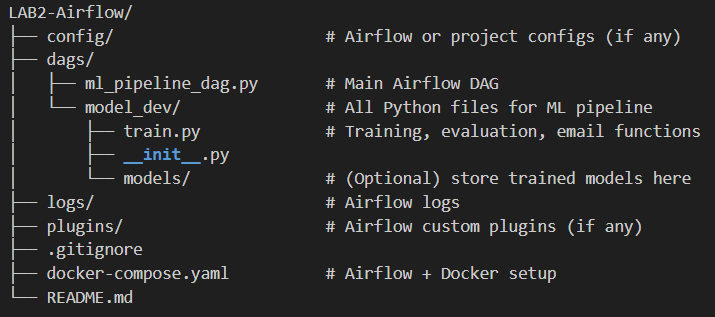

===============================

Airflow DAG & train.py Code Explanation

===============================

---

## 1️⃣ Imports and Constants

```python
import os
import pandas as pd
from sklearn.datasets import load_iris
from sklearn.model_selection import train_test_split
from sklearn.metrics import classification_report
from sklearn.ensemble import RandomForestClassifier
import pickle
import smtplib
from email.mime.text import MIMEText
from email.mime.multipart import MIMEMultipart
```

- os: for file path manipulation.
- pandas: for data manipulation and CSV reading/writing.
- load_iris: load Iris dataset.
- train_test_split: split dataset into train/test.
- classification_report: evaluate model performance.
- RandomForestClassifier: ML model.
- pickle: save/load model.
- smtplib & email: send evaluation email.

```python
DATA_PATH = "/opt/airflow/dags/model_dev/data"
MODEL_DIR = "/opt/airflow/dags/models"
```
- Paths for storing data and trained model.

---

## 2️⃣ Function: load_data()

```python
def load_data():
    X, Y = load_iris(return_X_y=True, as_frame=True)
    X["Target"] = Y
    X.to_csv(os.path.join(DATA_PATH, "raw_data.csv"), index=False)
    print("Raw data saved.")
```
- Loads Iris dataset.
- Adds target column.
- Saves raw CSV.

Purpose: Prepare raw dataset.

---

## 3️⃣ Function: split_dataset()

```python
def split_dataset():
    df = pd.read_csv(os.path.join(DATA_PATH, "raw_data.csv"))
    X_train, X_test, y_train, y_test = train_test_split(
        df.iloc[:, :-1], df.iloc[:, -1], train_size=0.8, random_state=42
    )
    X_train.to_csv(os.path.join(DATA_PATH, "X_train.csv"), index=False)
    X_test.to_csv(os.path.join(DATA_PATH, "X_test.csv"), index=False)
    y_train.to_csv(os.path.join(DATA_PATH, "y_train.csv"), index=False)
    y_test.to_csv(os.path.join(DATA_PATH, "y_test.csv"), index=False)
    print("Data split completed.")
```
- Splits raw data into train/test.
- Saves separate CSVs.

Purpose: Prepare data for training and testing.

---

## 4️⃣ Function: train_model()

```python
def train_model():
    X_train = pd.read_csv(os.path.join(DATA_PATH, "X_train.csv"))
    y_train = pd.read_csv(os.path.join(DATA_PATH, "y_train.csv"))

    clf = RandomForestClassifier()
    clf.fit(X_train, y_train)
    print("Model trained.")

    model_path = os.path.join(MODEL_DIR, "random_forest_model.pkl")
    with open(model_path, "wb") as f:
        pickle.dump(clf, f)
    print(f"Model saved at {model_path}")

    return model_path
```
- Trains Random Forest on training data.
- Saves model using pickle.
- Returns model path.

Purpose: Train and persist model.

---

## 5️⃣ Function: evaluate_model(model_path)

```python
def evaluate_model(model_path):
    X_test = pd.read_csv(os.path.join(DATA_PATH, "X_test.csv"))
    y_test = pd.read_csv(os.path.join(DATA_PATH, "y_test.csv"))

    with open(model_path, "rb") as f:
        clf = pickle.load(f)

    preds = clf.predict(X_test)
    report = classification_report(y_test, preds)
    print("Evaluation report:\n", report)
    return report
```
- Loads test data and model.
- Generates predictions and classification report.

Purpose: Evaluate model performance.

---

## 6️⃣ Function: send_email(report, ...)

```python
def send_email(report, sender_email, receiver_email, smtp_server, smtp_port, login, password):
    msg = MIMEMultipart()
    msg["From"] = sender_email
    msg["To"] = receiver_email
    msg["Subject"] = "Model Evaluation Report"

    msg.attach(MIMEText(report, "plain"))

    try:
        with smtplib.SMTP(smtp_server, smtp_port) as server:
            server.starttls()
            server.login(login, password)
            server.send_message(msg)
        print("Email sent successfully!")
    except Exception as e:
        print("Failed to send email:", e)
```
- Sends evaluation report via email using SMTP.

Purpose: Notify stakeholders with results.

---

## 7️⃣ Airflow DAG: model_dev_dag

```python
with DAG(
    dag_id="model_dev_dag",
    start_date=datetime(2025, 10, 6),
    schedule=None,
    catchup=False,
    tags=["ml", "training"],
) as dag:
```
- Defines Airflow workflow.
- Manual trigger only (`schedule=None`).

---

## 8️⃣ Airflow Tasks

### Load Data Task
```python
load_data_task = PythonOperator(task_id="load_data", python_callable=train.load_data)
```
- Calls `load_data()`.

### Split Dataset Task
```python
split_data_task = PythonOperator(task_id="split_dataset", python_callable=train.split_dataset)
```
- Calls `split_dataset()`.

### Train Model Task
```python
def train_model_callable(**kwargs):
    model_path = train.train_model()
    kwargs['ti'].xcom_push(key='model_path', value=model_path)
```
- Trains model and pushes model path to XCom.

### Evaluate Task
```python
def evaluate_model_callable(**kwargs):
    ti = kwargs['ti']
    model_path = ti.xcom_pull(task_ids='train_model', key='model_path')
    report = train.evaluate_model(model_path)
    ti.xcom_push(key='eval_report', value=report)
```
- Pulls model path from XCom.
- Evaluates model and pushes report.

### Send Email Task
```python
def send_email_callable(**kwargs):
    ti = kwargs['ti']
    report = ti.xcom_pull(task_ids='evaluate_model', key='eval_report')
    train.send_email(report, ...)
```
- Sends evaluation report via email.

---

## 9️⃣ Task Dependencies

```python
load_data_task >> split_data_task >> train_model_task >> evaluate_task >> email_task
```
- Defines execution order of tasks in DAG.
- Ensures proper flow: Load → Split → Train → Evaluate → Email.

---

## ✅ Summary
1. Load Iris dataset → save CSV.
2. Split dataset → save train/test CSVs.
3. Train Random Forest → save model.
4. Evaluate model → generate report.
5. Send email with report.

- PythonOperators execute `train.py` functions.
- XComs pass data (model path, report) between tasks.
- DAG allows end-to-end automation of ML workflow with Airflow.


🚀 Airflow ML Pipeline

This project orchestrates a complete Machine Learning training workflow using Apache Airflow inside Docker.  
It trains a simple ML model, evaluates it, and then sends an email notification with the training report — all fully automated via scheduled Airflow DAGs.

------------------------------------------------------------
🧠 Features
------------------------------------------------------------
- Orchestrated ML workflow using Apache Airflow
- Training & Evaluation of a sample ML model (using scikit-learn)
- Automated email notification after training is complete
- Fully containerized with Docker & Docker Compose
- Easy to extend for custom datasets, models, or workflows

------------------------------------------------------------
🧰 Tech Stack
------------------------------------------------------------
- Apache Airflow – Workflow orchestration
- Docker & Docker Compose – Containerization
- Python 3.12
- scikit-learn
- pandas
- numpy
- matplotlib

------------------------------------------------------------
📁 Project Structure
------------------------------------------------------------


------------------------------------------------------------
⚡ Quick Start
------------------------------------------------------------
1️⃣ Clone the Repository
git clone https://github.com/yourusername/airflow-ml-pipeline.git
cd airflow-ml-pipeline

2️⃣ Configure Email
In train.py, update the send_email call with your sender email and App Password (not your regular Gmail password).
Create an App Password here: https://myaccount.google.com/apppasswords

train.send_email(
    report,
    sender_email="youremail@gmail.com",
    receiver_email="recipient@gmail.com",
    smtp_server="smtp.gmail.com",
    smtp_port=587,
    login="youremail@gmail.com",
    password="YOUR_APP_PASSWORD"
)

⚠️ Make sure 2-Step Verification is enabled on your Gmail account.

3️⃣ Build and Run the Containers
docker compose build
docker compose up -d

This will start the Airflow webserver, scheduler, and supporting services.
Default Airflow UI: http://localhost:8080
- Username: airflow
- Password: airflow

4️⃣ Access Airflow UI
Go to the Airflow UI and enable the ml_training_dag.
Trigger it manually or wait for the scheduled run.

------------------------------------------------------------
📬 Email Notification
------------------------------------------------------------
Once the model training is completed, Airflow will automatically trigger the email task to send you the training report.

------------------------------------------------------------
🧠 Customization
------------------------------------------------------------
- Add your own ML code inside train.py.
- Modify the DAG in dags/ml_pipeline_dag.py to add more tasks (e.g., data preprocessing, model deployment).
- Add secrets management or environment variables for better security.

------------------------------------------------------------
🧹 Cleanup
------------------------------------------------------------
To stop all containers:
docker compose down

To remove volumes as well (reset state):
docker compose down -v

------------------------------------------------------------
🧑‍💻 Author
------------------------------------------------------------
Jay Jajoo
📧 jayjajoo02@gmail.com

