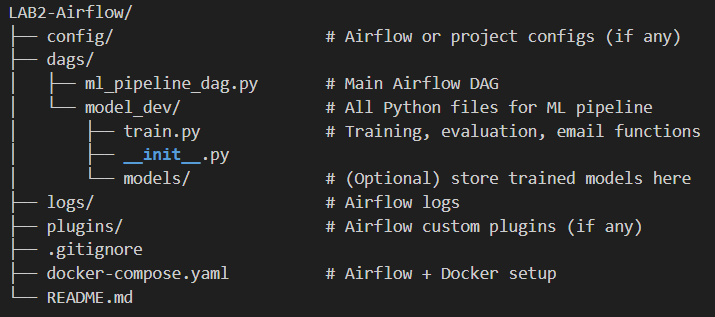

🚀 Airflow ML Pipeline

This project orchestrates a complete Machine Learning training workflow using Apache Airflow inside Docker.  
It trains a simple ML model, evaluates it, and then sends an email notification with the training report — all fully automated via scheduled Airflow DAGs.

------------------------------------------------------------
🧠 Features
------------------------------------------------------------
- Orchestrated ML workflow using Apache Airflow
- Training & Evaluation of a sample ML model (using scikit-learn)
- Automated email notification after training is complete
- Fully containerized with Docker & Docker Compose
- Easy to extend for custom datasets, models, or workflows

------------------------------------------------------------
🧰 Tech Stack
------------------------------------------------------------
- Apache Airflow – Workflow orchestration
- Docker & Docker Compose – Containerization
- Python 3.12
- scikit-learn
- pandas
- numpy
- matplotlib

------------------------------------------------------------
📁 Project Structure
------------------------------------------------------------

------------------------------------------------------------
⚡ Quick Start
------------------------------------------------------------
1️⃣ Clone the Repository
git clone https://github.com/yourusername/airflow-ml-pipeline.git
cd airflow-ml-pipeline

2️⃣ Configure Email
In train.py, update the send_email call with your sender email and App Password (not your regular Gmail password).
Create an App Password here: https://myaccount.google.com/apppasswords

train.send_email(
    report,
    sender_email="youremail@gmail.com",
    receiver_email="recipient@gmail.com",
    smtp_server="smtp.gmail.com",
    smtp_port=587,
    login="youremail@gmail.com",
    password="YOUR_APP_PASSWORD"
)

⚠️ Make sure 2-Step Verification is enabled on your Gmail account.

3️⃣ Build and Run the Containers
docker compose build
docker compose up -d

This will start the Airflow webserver, scheduler, and supporting services.
Default Airflow UI: http://localhost:8080
- Username: airflow
- Password: airflow

4️⃣ Access Airflow UI
Go to the Airflow UI and enable the ml_training_dag.
Trigger it manually or wait for the scheduled run.

------------------------------------------------------------
📬 Email Notification
------------------------------------------------------------
Once the model training is completed, Airflow will automatically trigger the email task to send you the training report.

------------------------------------------------------------
🧠 Customization
------------------------------------------------------------
- Add your own ML code inside train.py.
- Modify the DAG in dags/ml_pipeline_dag.py to add more tasks (e.g., data preprocessing, model deployment).
- Add secrets management or environment variables for better security.

------------------------------------------------------------
🧹 Cleanup
------------------------------------------------------------
To stop all containers:
docker compose down

To remove volumes as well (reset state):
docker compose down -v

------------------------------------------------------------
🧑‍💻 Author
------------------------------------------------------------
Jay Jajoo
📧 jayjajoo02@gmail.com
