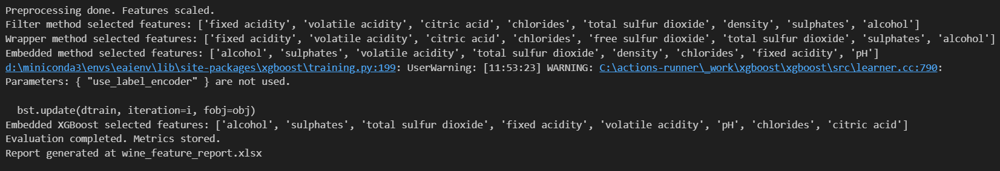
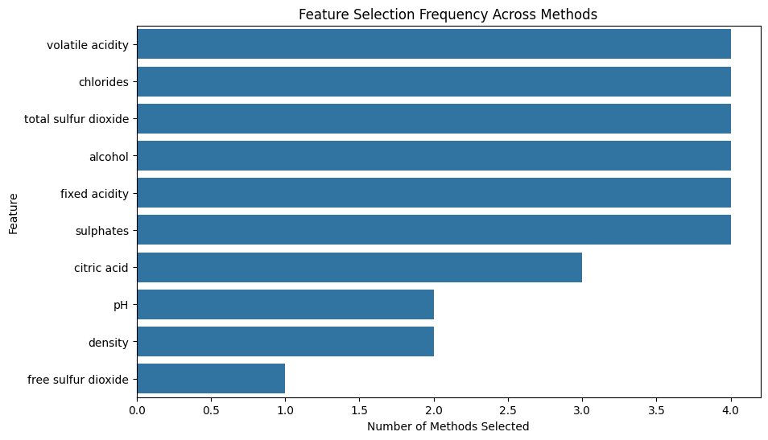
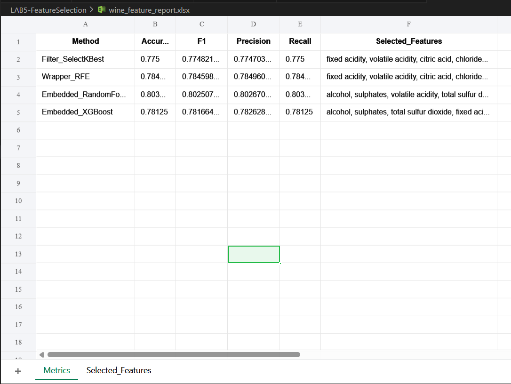
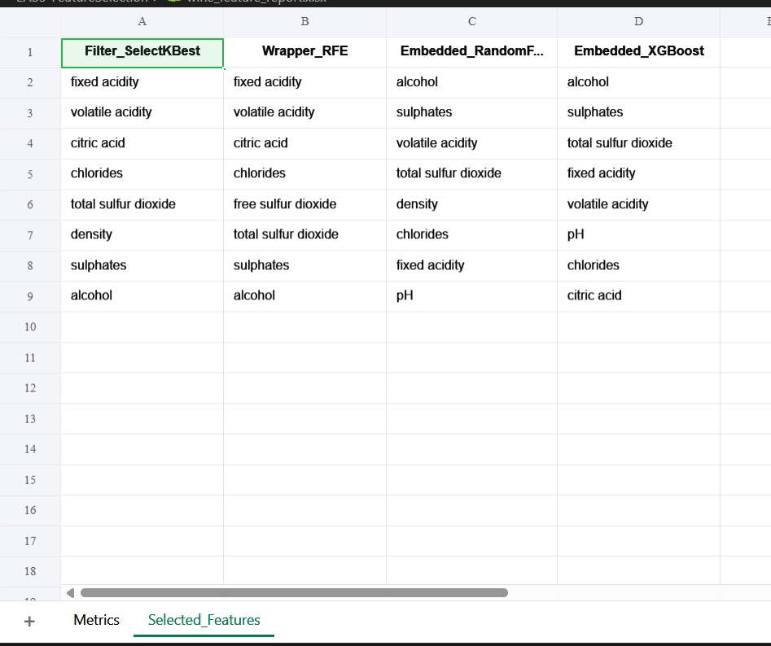

# Wine Quality Feature Selection Pipeline

A Python pipeline to perform **staged feature selection** on the Wine Quality dataset using **filter, wrapper, and embedded methods**, evaluate model performance, and generate a **final Excel report** summarizing the results.

---

## **Features**

* **Staged pipeline**:

  1. **Preprocessing**: Scaling of numerical features
  2. **Filter method**: SelectKBest (univariate feature selection)
  3. **Wrapper method**: Recursive Feature Elimination (RFE)
  4. **Embedded methods**: Random Forest & XGBoost feature importance
  5. **Evaluation**: Train a Random Forest classifier and report metrics
  6. **Report generation**: Excel file with metrics and selected features
  7. **Visualization**: Optional bar plot of feature selection frequency

* **Flexible**: Swap in other datasets or adjust number of selected features.

* **Automated report**: Easily track which features are selected and their impact on model performance.

---

## **Installation**

```bash
pip install pandas numpy scikit-learn xgboost openpyxl matplotlib seaborn
```

---

## **Usage**

```bash
python wine_feature_pipeline.py
```

### **Steps**

1. The script loads the **Wine Quality dataset** from UCI.
2. Converts the `quality` target to **binary** (good/bad wine).
3. Runs the **staged feature selection pipeline**:

   * Preprocessing
   * Filter selection (SelectKBest)
   * Wrapper selection (RFE)
   * Embedded selection (Random Forest & XGBoost)
4. Evaluates selected features using **Random Forest classifier**.
5. Generates an **Excel report** (`wine_feature_report.xlsx`) with:

   * Metrics (Accuracy, F1, Precision, Recall)
   * Selected features per method
6. Optional: Plots **feature selection frequency** across methods.

---

## **Output**

* `wine_feature_report.xlsx`

  * **Metrics sheet**: Model performance per feature selection method
  * **Selected_Features sheet**: Features chosen by each method

* **Feature importance plot** (optional)

---

## **Customization**

* Change `top_k` in `filter_methods()` or `n_features_to_select` in `wrapper_methods()` to select a different number of features.
* Swap `df` with any other dataset and adjust the `target` column.
* Use different classifiers for evaluation (e.g., Logistic Regression, XGBoost).

---

## **Example Screenshot**





## Output





---